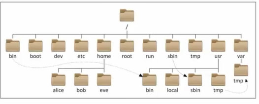
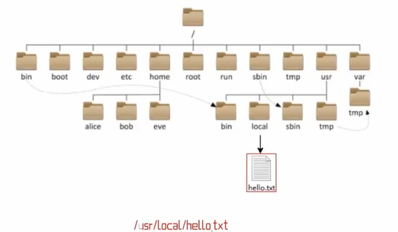
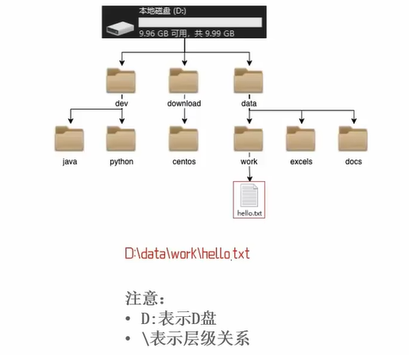

## 第二章 Linux基础命令

### 1 Linux的目录结构

#### Linux的目录结构是一个树形结构

Windows系统可以拥有多个盘符，如c盘、d盘、e盘

Linux没有盘符这个概念，只有一个根目录/，所有文件都在它下面

Linux路径的描述方法

在linux系统中，路径之间的层级关系，使用：/来表示

例：

在windows系统中，路径之间的层级关系，使用：\来表示

例：

#### / 在Linux系统中表示

出现在开头的/表示：根目录

出现在后面的/表示：层次关系

### 2 linux命令入门

#### Linux命令基础

命令：即Linux操作指令，是系统内置的程序，可以以字符化的形式去使用

命令行：即Linux终端，可以提供字符化的操作页面供命令执行

#### Linux命令的通用格式

command [-options] [parameter]

+ 命令本体，即命令本身
+ 可选选项，控制命令的行为细节
+ 可选参数，控制命令的指向目标

### 3 ls命令入门

#### ls 命令的作用是

在命令行中，以平铺的形式，展示当前工作目录（默认HOME目录）下的内容（文件或者文件夹）

#### HOME目录是

每一个用户在Linux系统的专属目录，默认在：/home/用户名

#### 当前工作目录

Linux命令行在执行命令的时候，需要一个工作目录，打开命令行程序（终端）默认设置工作目录在用户的HOME目录