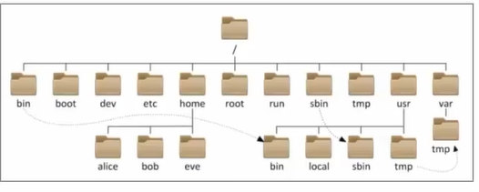
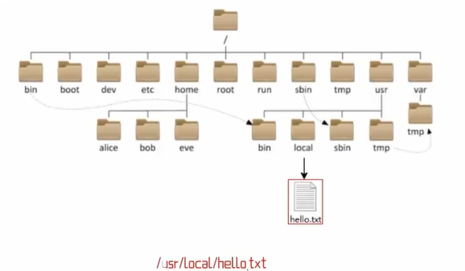
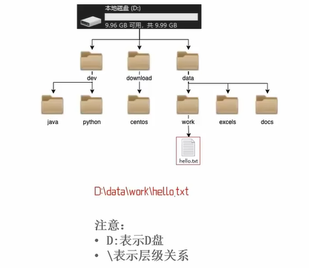

## 第二章 Linux基础命令

### 01-Linux的目录结构

> #### Linux的目录结构是一个树形结构
>
> Windows系统可以拥有多个盘符，如c盘、d盘、e盘
>
> Linux没有盘符这个概念，只有一个根目录/，所有文件都在它下面
>
> 
>
> Linux路径的描述方法
>
> 在linux系统中，路径之间的层级关系，使用：/来表示
>
### 例：
> 

> 在windows系统中，路径之间的层级关系，使用：\来表示
>
>
> 
>#### / 在Linux系统中表示
> 
>出现在开头的/表示：根目录

> 出现在后面的/表示：层次关系

### 02-linux命令入门
> #### Linux命令基础
>
> 命令：即Linux操作指令，是系统内置的程序，可以以字符化的形式去使用
>
> 命令行：即Linux终端，可以提供字符化的操作页面供命令执行
>
> #### Linux命令的通用格式
>
> command [-options] [parameter]
>
> + 命令本体，即命令本身
> + 可选选项，控制命令的行为细节
> + 可选参数，控制命令的指向目标
>

### 03-ls命令入门

> ### 1、ls 命令的作用是
>
> 在命令行中，以平铺的形式，展示当前工作目录（默认HOME目录）下的内容（文件或者文件夹）
>
> ### 2、HOME目录是
>
> 每一个用户在Linux系统的专属目录，默认在：/home/用户名
>
> ### 3、当前工作目录
>
> Linux命令行在执行命令的时候，需要一个工作目录，打开命令行程序（终端）默认设置工作目录在用户的HOME目录

### 04-ls命令的参数和选项

> ### 1、ls命令的参数的作用
>
> 可以指定要查看的文件夹（目录）的内容，如果不给定参数，就查看当前工作目录的内容
>
> ### 2、ls命令的选项
>
> + -a选项，可以展示出隐藏的内容
> 	+ 以.开头的文件或文件夹默认被隐藏，需要-a才能显示出来
> + -l选项，以列表的形式展示内容，并展示更多细节
> + -h选项，需要和-l选项搭配使用，以更加人性化的方式显示文件的大小单位
>
> ### 3、命令的选项组合使用
>
> + 命令的选项是可以组合使用的，比如：ls -lah ，等同于ls -a -l -h

### 05-cd-pwd命令

> ### 1、cd命令的作用
>
> + cd命令来自英文：Change Directory
> + cd命令可以切换当前工作目录，语法是：
> 	+ `cd [Linux路径]`
> 	+ 没有选项，只有参数，表示目标路径
> 	+ 使用参数，切换到指定路径
> 	+ 不使用参数，切换到工作目录到当前用户的HOME
>
> ### 2、pwd命令的作用
>
> + pwd命令来自英文：Print Work Directory
> + pwd命令，没有选项，没有参数，直接使用即可
> + 作用是：输出当前所在的工作目录

### 06-相对路径绝对路径和特殊路径符

> ### 1、相对路径和绝对路径
>
> + 绝对路径：以根目录做起点，描述路径的方式，路径以/开头
> + 相对路径：以当前目录做起点，描述路径的方式，路径不需要以/开头
>
> ### 2、特殊路径符有哪些？
>
> + .表示当前目录，比如cd . 或cd ./Desktop
> + ..表示上一级目录，比如cd .. 或 cd ../..
> + ~表示用户的HOME目录，比如：cd ~ 或 cd ~/Desktop

### 07-创建目录命令（mkdir）

> ### 1、mkdir命令的语法和功能
>
> + mkdir用以创建新的目录（文件夹）
> + 语法：`mkdir [-p] Linux路径`
> + 参数必填，表示要创建的目录的路径，相对、绝对、特殊路径符都可以使用
>
> ### 2、-p选项的作用
>
> + 可选，表示自动创建不存的父目录，适用于创建连续多层级的目录

### 08-文件操作命令（touch、cat、more）

> ### 1、touch命令
>
> + 用于创建一个的新文件
> + 语法：`touch Linx路径`
> + 参数必填，表示要创建的文件的路径，相对、绝对、特殊路径符都可以使用
>
> ### 2、cat命令
>
> + 用于查看文件内容
> + 语法`cat Linux路径`
> + 参数必填，表示要查看的文件的路径，相对、绝对、特殊路径符都可以使用
>
> ### 3、more命令
>
> + 用于查看文件内容，可翻页查看
> + 语法：`more Liunx路径`
> + 参数必填，表示要查看的文件的路径，相对、绝对、特殊路径符都可以使用
> + 使用空格进行翻页，使用q退出查看

### 09-文件操作命令（cp、mv、rm）

> ### 1、cp命令
>
> + 用于复制文件或文件夹
> + 语法：`cp [r] 参数1 参数2`
> + -r选项，可选，用于复制文件夹使用，表示递归
> + 参数1，Liunx路径，表示被复制的文件或文件夹
> + 参数2，Liunx路径，表示要复制去的地方
>
> ### 2、mv命令
>
> + 用于查看文件内容
> + 语法：`mv 参数1 参数2`
> + 参数1，Liunx路径，表示被移动的文件或文件夹
> + 参数2，Liunx路径，表示要移动去的地方，如果目标不存在，则进行改名
>
> ### 3、rm命令 
>
> + 用于复制文件或文件夹
> + 语法：`rm [-r -f] 参数1 参数2 ………… 参数N`
> + -r选项，可选，文件夹删除
> + -f选项，可选用于强制删除（不提示，一般用于root用户）
> + 参数，表示被删除的文件或文件夹路径，支持多个，空格隔开
> + 参数也支持通配符* ，用以做模糊匹配

### 10-查找命令（which、find）

> ### 1、which命令
>
> + 查找命令的程序文件
> + 语法`which 要查找的命令`
> + 无需选项，只需要参数表示查找哪个命令
>
> ### 2、find命令
>
> + 用于查找指定的文件
> + 按文件名查找`find 起始路径 -name "被查找文件名"`
> 	+ 支持通配符
> + 按文件大小查找`find 起始路径 -size +|-n[kMG]`

### 11-grep、wc和管道符

> ### 1、grep命令
>
> + 从文件中通过关键字过滤文件行
> + 语法：`grep [-n] 关键字 文件路径`
> + 选项-n ，可选，表示在结果中显示匹配的行的行号。
> + 参数，关键字，必填，表示过滤的关键字，建议使用” “将关键字包围起来
> + 参数，为念路径，必填，表示要过滤内容的文件路径，可作为管道符的输入
>
> ### 2、wc命令
>
> + 命令统计文件的行数、单词数量、字节数、字符数等
> + 语法`wc [-c -m -l -w] 文件路径`
> + 不带选项默认统计：行数、单词数、字节数
> + -c字节数，-m字符数，-l行数，-w单词数
> + 参数，被统计的文件路径，可作为管道符的输入
>
> ### 3、管道符
>
> + 将管道符左边命令的结果，作为右边命令的输入

### 12-echo、tail和重定向符

> ### 1、echo命令
>
> + 可以使用echo命令在命令行中输出指定内容
> + 语法：`echo  输出的内容`
> + 无需选项，只有一个参数，表示要输出的内容，复杂内容可以用” “包围
>
> ### 2、反引号符
>
> + 被`包围的内容，会被作为命令执行，而非普通字符
>
> ### 3、重定向符
>
> + `>`,将左侧命令的结果，覆盖写入到右侧指定的文件中
> + `>>`,将左侧从命令的结果，追加写入到符号右侧指定的文件中
>
> ### 4、tail命令
>
> + 查看文件尾部内容，并可以持续跟踪
> + 语法：`tail [-f -num] Liunx路径`
> + -f：持续跟踪，-num：启动的时候查看尾部多少行，默认10
> + Liunx路径，表示被查看的文件

### 13-vi编辑器

> 1、什么是vi/vim编辑器
>
> + vi/vim编辑器，就是命令行模式下的文本编辑器，用来编辑文件
> + vim是vi的升级版，一般用vim即可，包含全部vi功能
>
> 2、基础命令
>
> `vi 文件路径`
>
> `vim 文件路径`
>
> ### 3、运行模式
>
> + 命令模式，默认的模式，可以通过键盘快捷键控制文件内容
> + 输入模式，通过命令模式进入，可以输入内容进行编辑，按esc退回命令模式
> + 底线命令模式，通过命令模式进入，可以对文件进行保存、关闭等操作

