# Git

版本控制系统

+ 集中式：SVM
+ 分布式：git

**集中式：**所有文件都保存在中央服务器上，每个人电脑上只保存了一个副本，当你需要修改文件的时候，你需要从中央服务器上下载最新的版本，然后添加你想要的修改内容，修改完成后再上传给中央服务器

优点：使用起来非常简单

缺点：中央处理单点故障问题

**分布式：**每个人的电脑上都有一个完整的版本库，可以在本地进行修改


## 02 git 初始化

 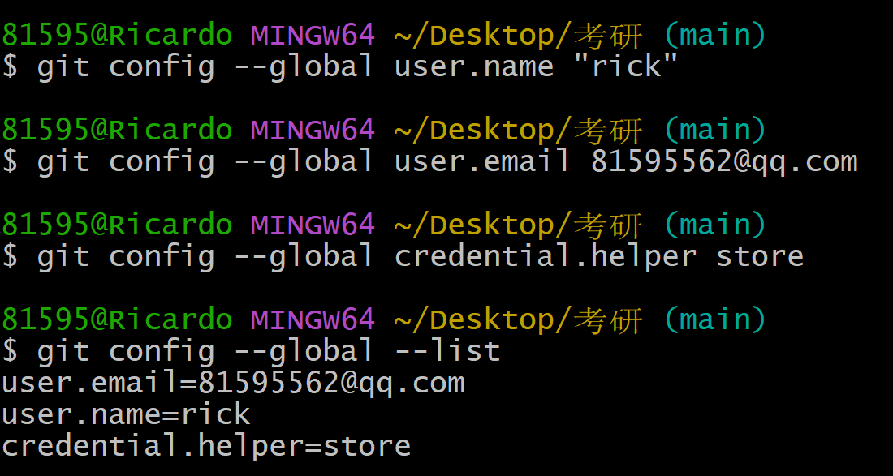

git config

## 03 新建仓库

### 方式一：git init

 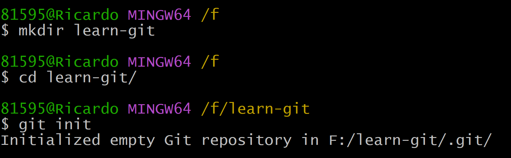

用git init 创建仓库

 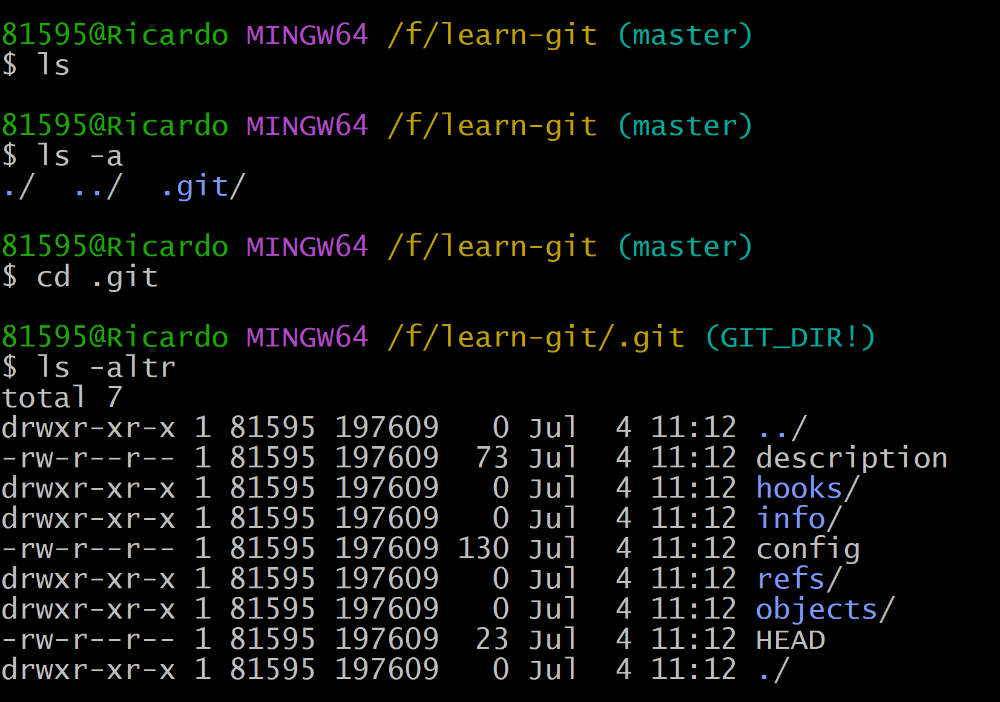

git的文件夹是因此起来的所以ls看不到需要用ls -a（不能随意删除）

### 方式二：git clone

## 04工作区域和文件状态

### 工作区域

#### **工作区（Working Directory）**

#### **暂存区(Staging Area/Index):** git add 

#### **本地仓库(Local Respository):** git commit

### 文件状态

未跟踪

未修改

已修改

已经暂存

 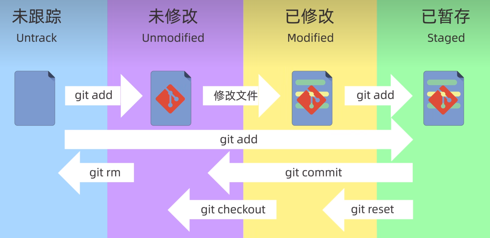

## 05 添加和提交文件

### git init：创建仓库

### git status：查看仓库的状态

### git add：添加到暂存区

+ 可以使用通配符，例如：git add *.txt
+ 也可以使用目录，例如：git add .

### git commit：提交

+ 只能提交暂存区的内容，不会提交工作区的内容

### git log：查看仓库提交历史记录

+ 可以使用 --oneline参数来查看简洁的提交记录

## 06 git rest 回退版本

git reset的三种模式

### git reset --soft ：

回退到某一个版本，并且保留工作区和暂存区的所有修改内容

### git reset --hard：

回退到某一个版本，并且丢弃工作区和暂存区的所有修改内容

### git reset --mixed：（默认）

介于soft和hard两个参数之间，他表示回退到某一个版本，并且指保留工作区的修改内容，而丢弃暂存区的修改内容，mixed也是reset命令的默认参数

其中：

ls 查看工作区文件

git ls-files 查看暂存区的文件

如果误删了也可以git reflog（查看所有版本） 

## 07 使用git diff 查看差异

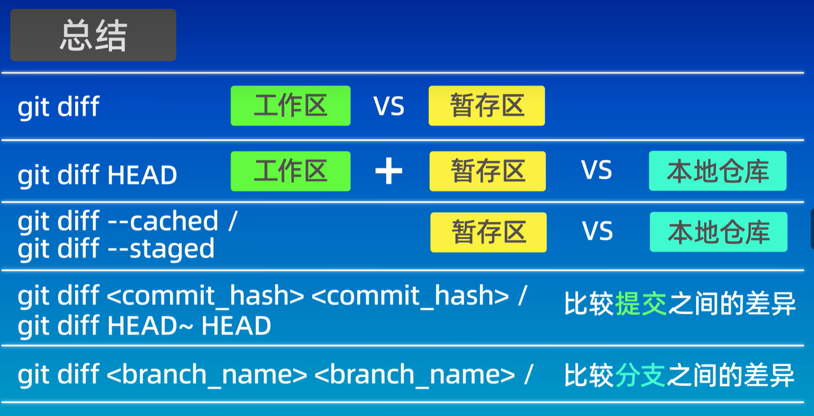

## 08 使用git rm删除文件

### 使用rm删除

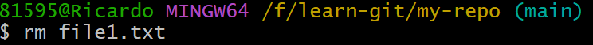

工作区删除文件（注意这里的rm并不是git的命令而是Linux系统的命令）

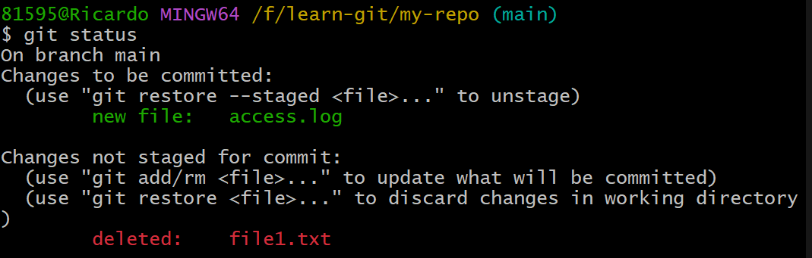

只删了本地的文件而暂存区没有删除

可以通过git ls-files查询暂存区的内容

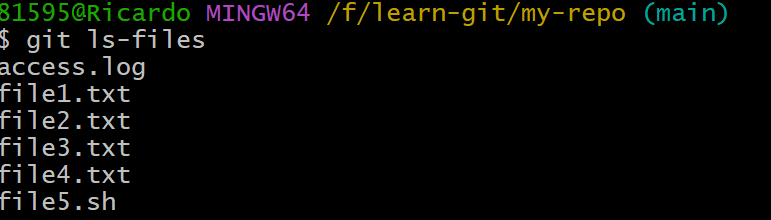

这里的git add 有点同步的意思

使用完才算删除完毕

### 使用git rm删除

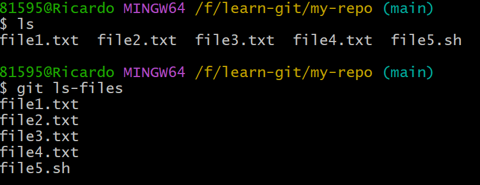

git rm

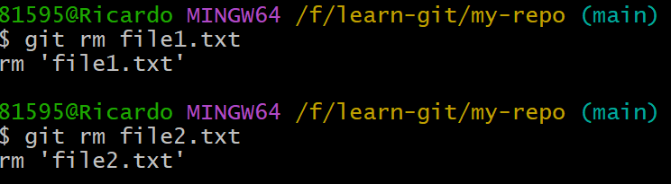

工作区和暂存区全部删除

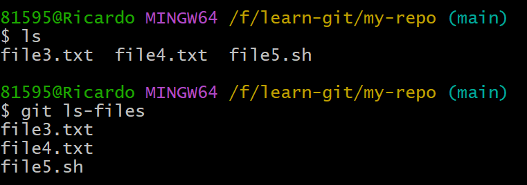

最后提交一下

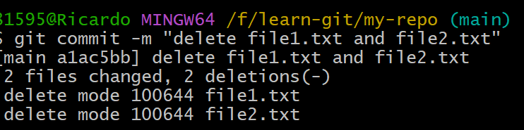

删除完毕

### 总结

### rm files；git add files

先从工作区删除，然后在暂存区删除内容

### git rm \<file\>

把文件从工作区和暂存区同时删除

### git rm --cached<file\>

把文件从暂存区删除，但保留在工作区中

### git rm -r*

递归删除某个目录下的所有子目录和文件

删除后不要忘记提交

## 09 gitignore忽略文件

### 应该忽略哪些文件

+ 系统或者软件自动生成的文件
+ 编译产生的中间文件和结果文件
+ 运行时生成日志文件、缓存文件、临时文件
+ 涉及身份、密码、口令、密钥等敏感信息文件

.gitignore文件的匹配规则

+ 空行或者以#开头的行会被Git忽略。一般空行用于可读性的分离，#一般用作注释
+ 使用标准的Blob模式进行匹配，例如：
  + 星号 * 通配任意个字符
  + 问号 ？匹配单个字符
  + 中括号[]表示匹配列表中的单个字符，比如：[abc]表示a/b/c

+ 两个星号 ** 表示匹配任意的中间目录
+ 中括号可以使用短中线连接，比如：[0-9]表示任意一位数字，[a-z]表示任意一位小写字母
+ 感叹号！ 表示取反

### 例子

```shell
# 忽略所有的 .a文件
*.a

# 但跟踪所有的 lib.a，即便你在前面忽略了 .a文件
！lib.a

# 只忽略当前目录下的 TODO 文件，而不忽略 subdir/TODO
/TODO

# 忽略任何目录下名为 build 的文件夹
build/

# 忽略 doc/notes/txt 但不忽略 doc/server/arh.txt
doc/*.txt

#忽略 doc/ 目录及其所有子目录下的 .pdf 文件
".gitignore" 17L,383B
```

### 注意事项：

如果，某个文件已经commit之后在gitignore是不生效的。只有删除才行

使用git rm --cached<file\>将库中删除保留本地

github上给了各种常用语言的忽略文件的模板地址：

www.github.com/github/gitignore

## 10 注册GitHub账号

## 11 SSH配置和远程仓库

### git clone：克隆仓库

### git pull：推送更新内容

### git push：拉取更新内容

### ssh-keygen -t rsa -b 4096:生成SSH Key

私钥文件：id_rsa

公钥文件：id_rsa.pub

## 12 关联本地仓库和远程仓库

总结

### 添加远程仓库

#### git remote add <远程仓库别名><远程仓库地址>

#### git push -u <远程仓库别名><分支名>

### 查看远程仓库

#### git remote -v

拉取远程仓库内容

git pull <远程仓库名><远程分支名>:<本地分支名>(相同可省略冒号后面的内容)

## Gitee的使用和GitLab本地化

## 14 GUI工具

## 15在VSCode中使用Git

code. 用vscode打开仓库

总结

布局:菜单栏、侧边栏、编辑区、终端区

打开命令面板：Ctrl+Shift+`

配置文件：setting.json

Git操作：在侧边栏中的源码管理器UI界面中操作

## 16 分支简介和基本操作

### git branch:查看分支列表

git branch branch-name:创建分支

git checkout branch-name:切换分支(可能会出现冲突)

git switch branch-name:切换分支(推荐)

git merge branch-name:合并分支

git branch -d branch-name:删除分支(已合并)

git branch -D branch-name:删除分支(未合并)