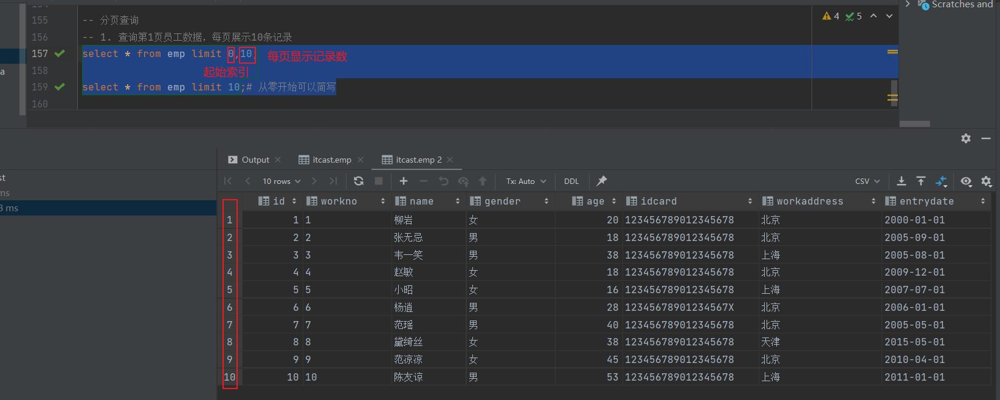
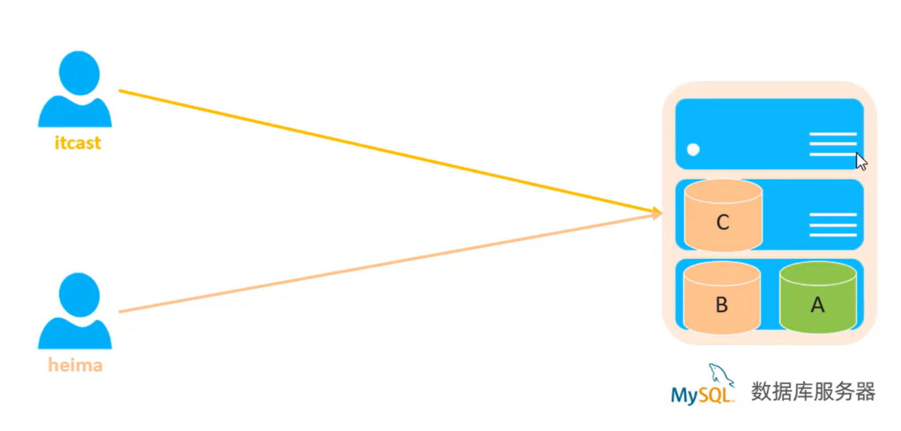

#  数据库

## MYSQL 基础篇

### 1 MYSQL概述

> ## 1、数据库相关概念
>
> | 名称           | 数据库管理系统                                               | 简称                               |
> | -------------- | ------------------------------------------------------------ | ---------------------------------- |
> | 数据库         | 存储数据的仓库，数据是有组织的进行存储                       | DataBase（DB）                     |
> | 数据库管理系统 | 操纵和管理数据库的大型软件                                   | DataBase Management System（DBMS） |
> | SQL            | 操作关系型数据库的编程语言，定义了一套操作关系型数据库统一标准 | Structured Query language（SQL、） |
>
> 
>
> ### 主流的关系型数据库管理系统
>
> 
>
> ## 2、MYSQL数据库
>
> ### MySQL下载及安装
>
> ### MySQL启动与停止
>
> + 启动`net start mysql80`
> + 停止`net stop mysql80`
>
> 注：以管理员身份运行
>
>  
>
> ### MySQL客户端连接
>
> #### 方式一：MYSQL提供的客户端命令行工具
>
> 
>
> 
>
> #### 方法二：系统自带的命令行工具执行指令
>
> `mysql [-h 127.0.0.1][-p 3306] -u root -p`
>
> 
>
> 注：使用这种方式时，需要配置PATH环境变量
>
> ### MySQL数据模型
>
> ### 关系型数据库（RDBMS）
>
> 概念：建立在关系模型基础上，由多张相互连接的二维表组成的数据库
>
> 特点：
>
> 1. 使用表存储数据，格式统一，便于维护
> 2. 使用SQL语言操作，标准统一，使用方便
>
> 
>
> ### 数据模型
>
> 

### 2 SQL

#### 1）SQL通用语法

> 1. SQL语句可以单行或多行书写，以分号结尾。
> 2. SQL语句可以使用空格/缩进来增强语句的可读性
> 3. MySQL数据库的SQL语句不区分大小写，关键字建议使用大写。
> 4. 注释：
>    + 单行注释：-- 注释内容 或 # 注释内容（MySQL特有）
>    + 多行注释：/\*注释内容\*/
>

#### 2）SQL分类

> | 分类 | 全称                       | 说明                                                   |
> | ---- | -------------------------- | ------------------------------------------------------ |
> | DDL  | Data Definition Language   | 数据定义语言，用来定义数据库对象（数据库，表，字段）   |
> | DML  | Data Manipulation Language | 数据操作语言，用来对数据库表中的数据进行增删改         |
> | DQL  | Data Query Language        | 数据查询语言，用来查询数据库中表的记录                 |
> | DCL  | Data Control Language      | 数据控制语言，用来创建数据库用户、控制数据库的访问权限 |
>

#### 3）DDL(Data Definition Language):数据定义语言

##### 1、DDL-数据库操作

> #### 1）查询
>
> ##### **查询所有数据库**
>
> ```mysql
> SHOW DATABASES;
> ```
>
> 
>
> ##### **查询当前数据库**
>
> ```mysql
> SELECT DATABASE();
> ```
>
> #### 2）创建
>
> ```mysql
> CREATE DATABASE [IF NOT EXIST] 数据库名 [DEFAULT 字符集][COLLATE 排序规则];
> ```
>
> 
>
> 
>
> 
>
> 
>
> 
>
> #### 3)删除
>
> ```mysql
> DROP DATABASE [IF EXISTS]数据库名；
> ```
>
> 
>
> #### 4)使用
>
> ```mysql
> USE 数据库名
> ```
>
> 
>

##### 2、DDL-表操作

> ### DDL-表操作-查询
>
> #### 查询当前数据库所有的表
>
> ```mysql
> SHOW TABLES
> ```
>
> 
>
> #### 查询表结构
>
> ```mysql
> DESC 表名
> ```
>
> 
>
> #### 查询指定表的建表语句
>
> ```mysql
> SHOW CREATE TABLE 表名
> ```
>
> 
>
> ### DDL-表结构-创建
>
> ```mysql
> CREATE TABLE 表名(
> 	字段1 字段1类型[COMMENT 字段1注释]，
> 	字段2 字段2类型[COMMENT 字段1注释]，
> 	字段3 字段3类型[COMMENT 字段1注释]，
> 	……
> 	字段n 字段n类型[COMMENT 字段1注释]，
> )[COMMENT 表注释];
> ```
>
> 注意：[……]为可选参数，最后一个字段后面没有逗号
>
> 
>
> ### DDL-表操作-数据类型
>
> MySQL中的数据类型有很多，主要分为三类：数值类型、字符串类型、日期时间类型
>
> 参照MySQL数据类型。xlsx
>
> ### DDL-表操作-修改
>
> #### 添加字段
>
> ```mysql
> ALTER TABLE 表名 ADD 类型(长度)[COMMENT 注释][约束]
> ```
>
> **案例：**
>
> ```mysql
> ALTER TABLE emp ADD nickname varchar(20) COMMENT '昵称';
> ```
>
> #### 修改数据类型
>
> ```mysql
> ALTER TABLE 表名 MODIFY 字段名 新数据类型(长度);
> ```
>
> #### 修改字段名和字段类型
>
> ````mysql
> ALTER TABLE 表名 CHANGE 旧字段名 新字段名 类型(长度)[COMMENT注释][约束];
> ````
>
> 将user表中的name改名为username ，类型为varchar(30)
>
> ```mysql
> alter table user change name username varchar(30) comment '用户名'
> ```
>
> 
>
> #### 删除字段
>
> ```mysql
> ALTER TABLE 表名 DROP 字段名;
> ```
>
> 案例：将emp表的字段username删除
>
> ```
> alter table user drop username;
> ```
>
> 
>
> #### 修改表名
>
> ```mysql
> ALTER TABLE 表名 RENAME TO 新表名
> ```
>
> **案例：将user改名为gays**
>
> ```mysql
> alter table user rename to gays;
> ```
>
> 
>
> #### 删除表
>
> ```mysql
> DROP TABLE [IF EXISTS] 表名;
> ```
>
> 
>
> #### 删除指定表，并重新创建该表
>
> ```mysql
> TRUNCATE TABLE 表名;
> ```
>
> 

##### 3、DDL-总结

> ### **1、DDL数据库操作**
>
> ```mysql
> SHOW DATABASES;
> CREATE DATABASE 数据库名;
> USE 数据库名;
> SELECT DATABASE();
> DROP DATABASE 数据库名;
> ```
>
> ### **2、DDL-表操作**
>
> ```mysql
> SHOW TABLES;
> CREATE TABLE 表名(字段 字段类型，字段 字段类型);
> DESC 表名;
> SHOW CREATE TABLE 表名;
> ALTER TABLE 表名 ADD/MODIFY/CHANGE/DROP/RENAME TO……;
> DROP TABLE 表名;
> ```

#### 4)DML(Data Manipulation Language):数据操作语言

##### 1、DML介绍

> DML英文全称是Data Manipulation Language(数据操作语言)，用来对数据库中的数据记录进行增删改操作。
>
> + **添加数据（INSERT）**
> + **修改数据（UPDATE）**
> + **删除数据（DELETE）**

##### 2、DML添加数据

> **1.给指定字段添加数据**
>
> ```mysql
> INSERT INTO 表名(字段名1,字段名2,……) VALUES(值1,值2);
> ```
>
> 
>
> 
>
> **2.给全部字段添加数据**
>
> ```mysql
> INSERT INTO 表名 VALUES(值1,值2,……);
> ```
>
> 
>
> **3.批量添加数据**
>
> ```mysql
> INSERT INTO 表名(字段名1,字段名2，……)VALUES(值1，值2.……),(值1，值2.……),(值1，值2.……);
> ```
>
> ```mysql
> INSERT INTO 表名 VALUES(值1,值3,……),(值1,值3,……),(值1,值3,……);
> ```
>
> 
>
> 注意：
>
> + 插入数据时，指定的字段顺序需要与值的顺序是一一对应的。
> + 字符串的日期型数据应该包含在引号中。
> + 插入的数据大小，应该在字段的规定范围内。
>
> 最终运行结果
>
> 

##### 3、DML-修改数据

> ```mysql
> UPDATE 表名 SET 字段名1=值1，字段名2=值2，……[WHERE 条件];
> ```
>
> 注意：修改语句的条件可以有，也可以没有，如果没有条件，则会修改整张表的所有数据
>
> 
>
> 

##### 4、DML-删除数据

> ```mysql
> DELETE FROM 表名 [WHERE 条件];
> ```
>
> 注意：
>
> + DELETE语句的条件可以有，也可以没有，如果没有条件，则会删除整张表所有的数据。
> + DELETE语句不能删除某一个字段的值（可以使用UPDTAE）。
>
> 
>
> 
>
> 

##### 5、DML-总结

> ##### 1、添加数据
>
> ```mysql
> INSERT INTO 表名(字段1,字段2，……)VALUES(值1，值2.……)[,(值1，值2.……)……];
> ```
>
> #####  2、修改数据
>
> ```mysql
> UPDATE 表名 SET 字段1=值1,字段2=值2[WHERE 条件];
> ```
>
> ##### 3、删除数据
>
> ```mysql
> DELETE FROM 表名 [WHERE 条件]
> ```

##### 6)DML以上操作所有代码

> ```mysql
>  create table tb_user
>  (
>      id     int comment '编号',
>      name   varchar(50) comment '姓名',
>      age    int comment '年龄',
>      gender varchar(1) comment '性别'
>  ) comment '用户表';
> 
> drop table tb_user;
> show tables;
> 
> DESC tb_user;
> 
> show create table tb_user;
> 
> create table employee
> (
>     id        int comment '编号',
>     workno    varchar(10) comment '工号',
>     name      varchar(10) comment '姓名',
>     gender    char(1) comment '性别',
>     age       tinyint unsigned comment '年龄',
>     idcard    char(18) comment '身份证号',
>     entrydate date comment '入职时间'
> )comment '员工表';
> 
> drop table employee;
> 
> # 往表中插入数据
> insert into employee(id, workno, name, gender, age, idcard, entrydate)  values (1,'1','Icast','男',10,'123456789012345678','2000-01-01');
> insert into employee(id, workno, name, gender, age, idcard, entrydate)  values (2,'2','Icast2','男',-1,'123456789012345678','2000-01-01');
> 
> # 查询表中的内容
> 
> select * from employee;
> 
> # 给全部字段添加数据
> insert into employee values (2,'2','张无忌','男',18,'123456789012345678','2005-01-01');
> 
> # 批量添加数据
> insert into employee values (3,'3','韦一笑','男',38,'123456789012345678','2005-01-01'),(4,'4','赵敏','女',18,'123456789012345678','2005-01-01');
> insert into employee(id, workno, name, gender, age, idcard, entrydate) values (5,'5','周芷若','女',18,'123456789012345678','2005-01-01'),(6,'6','金庸','男',18,'123456789012345678','2005-01-01');
> 
> 
> 
> -- 修改id为1的数据，将name修改为shuwin
> update employee set name = 'shuwin' where id = 1;
> 
> -- 修改id为2的数据，将name修改为 鼠鼠，gender修改为男
> update employee set name ='鼠鼠',gender ='男' where id = 2;
> 
> -- 将所有员工的入职日期修改为 2008-01-01
> update employee set entrydate ='2008-01-01';
> 
> 
> -- 删除 gender 为女的员工
> delete from employee where gender = '女';
> 
> -- 删除所有员工
> delete from employee;
> ```

#### 5）DQL(Data Query Language):数据查询语言

##### 1、DQL-介绍

> DQL英文全称是Data Query Language(数据查询语言)，数据查询语言，用来查询数据库中表的记录
>
> 查询关键字：**SELECT**

##### 2、DQL-语法

> ```mysql
> SELECT
> 	字段列表
> FROM 
> 	表名列表
> WHERE
> 	条件列表
> GROUP BY
> 	分组字段列表
> HAVING
> 	分组后条件列表
> ORDER BY
> 	排序字段列表
> LIMIT
> 	分页参数
> ```

##### 3、DQL-基本查询

> 1.查询多个字段
>
> ```mysql
> SELECT 字段1，字段2，字段3…… FROM 表名;
> ```
>
> 
>
> ```mysql
> SELECT * FROM 表名;
> ```
>
> 
>
> 2.设置别名
>
> ```mysql
> SELECT 字段1 [AS 别名1], 字段2 [AS 别名2] …… FROM 表名;
> ```
>
> 
>
> 3.去除重复记录
>
> ```mysql
> SELECT DISTINCT 字段列表 FROM 表名;
> ```
>
> 

##### 4、DQL-条件查询

> ### 1.语法
>
> ```mysql
> SELECT 字段列表 FROM 表名 WHERE 条件列表;
> ```
>
> ### 2.条件
>
> | 比较运算符     | 功能                                       |
> | -------------- | ------------------------------------------ |
> | >              | 大于                                       |
> | >=             | 大于等于                                   |
> | <              | 小于                                       |
> | <=             | 小于等于                                   |
> | =              | 等于                                       |
> | <>或!=         | 不等于                                     |
> | BETWEEN……AND…… | 在某个范围之内（含最小值、最大值）         |
> | IN(……)         | 在in之后的列表中的值，多选一               |
> | LIKE 占位符    | 模糊匹配（_匹配单个字符，%匹配任意个字符） |
> | IS NULL        | 是NULL                                     |
>
> | 逻辑运算符 | 功能                         |
> | ---------- | ---------------------------- |
> | AND 或 &&  | 并且（多个条件同时成立）     |
> | OR 或 \|\| | 或者（多个条件任意一个成立） |
> | NOT 或 !   | 非、不是                     |
>
> ### 例题
>
> ```mysql
> -- 条件查询
> -- 1.查询年龄等于 88 的员工
> select * from emp where age = 88;
> 
> -- 2.查询年龄小于 20 的员工
> select * from emp where age < 20;
> 
> -- 3.查询年龄小于等于 20 的员工信息
> select * from emp where age <= 20;
> 
> -- 4.查询没有身份证号的员工信息
> select * from emp where idcard is null;
> 
> -- 5.查询有身份证号的员工信息
> select * from emp where idcard is not null;
> 
> -- 6.查询年龄不等于 88 的员工信息
> select * from emp where age <> 88;
> 
> -- 7.查询年龄在 15岁（包含）到 20岁（包含）之间的员工信息
> select * from emp where age>=15 and age<=20;
> select * from emp where age>=15 && age<=20;
> 
> select * from emp where age between 15 and 20;
> 
> select * from emp where age between 20 and 15;
> -- 8.查询性别为 女 且年龄小于25岁的员工信息
> select * from emp where age<25 and gender='女';
> 
> -- 9.查询年龄等于 18 或 20 或 40 的员工信息
> select * from emp where age = 18 || age =20 || age=40;
> select * from emp where age = 18 or age =20 or age=40;
> 
> select * from emp where age in(18,20,40);
> 
> -- 10.查询姓名为两个字的员工信息
> select * from emp where name like '__';
> 
> -- 11.查询身份证号最后一位是X的员工信息
> select * from emp where idcard like'%X';
> select * from emp where idcard like'_________________X';
> ```
>
> 
>
> 
>
> 
>
> 
>
> 
>
> 
>
> 
>
> 
>
> 
>
> 
>
> 

##### 5、DQL-聚合函数

> 1.介绍
>
> 将一列数据作为一个整体，进行纵向计算
>
> 2.常见的聚合函数
>
> | 函数  | 功能     |
> | ----- | -------- |
> | count | 统计数量 |
> | max   | 最大值   |
> | min   | 最小值   |
> | avg   | 平均值   |
> | sum   | 求和     |
>
> 3.语法
>
> ```mysql
> SELECT 聚合函数（字段列表）FROM 表名;
> ```
>
> 注意：所有的null值不参与函数的运算
>
> 例题：
>
> ```mysql
> -- 聚合函数
> -- 1.统计该企业员工数量
> select count(*) from emp;
> select count(id) from emp;
> 
> -- 2.统计该企业员工的平均年龄
> select avg(age) from emp;
> 
> -- 3.统计该企业员工的最大年龄
> select max(age) from emp;
> 
> -- 4.统计该企业员工的最小年龄
> select min(age) from emp;
> 
> -- 5.统计西安地区员工的年龄之和
> select sum(age) from emp where workaddress = '西安';
> ```
>
> 
>
> 
>
> 
>
> 
>
> 
>
> 

##### 6、DQL-分组查询

> ### 1.语法
>
> ```mysql
> SELECT 字段列表 FROM 表名 [WHERE 条件] GROUP BY 分段字段名 [HAVING 分组后过滤条件]
> ```
>
> ### 2.where与having区别
>
> + 执行时机不同：where是分组之前进行过滤，不满足where条件，不参与分组；而having是分组之后对结果进行过滤。
> + 判断条件不同：where不能对聚合函数进行判断，而having可以。
>
> 注意：
>
> + 执行·顺序：where >  聚合函数 > having
> + 分组之后，查询的字段一般为聚合函数和分组字段，查询其他字段无任何意义。
>
> ```mysql
> -- 分组查询
> -- 1. 根据性别分组，统计男性员工和女性员工的数量
> select gender,count(*) from emp group by gender;
> 
> -- 2. 根据性别进行分组，统计男性员工和女性员工的平均年龄
> select gender,avg(age) from emp group by gender;
> 
> -- 3. 查询年龄小于45的员工，并根据工作地址分组，获取员工数量大于等于3的工作地址
> select workaddress ,count(*) address_count from emp where age < 45 group by workaddress having count(*)>=3;
> ```
>
> 
>
> 
>
> 

##### 7、DQL-排序查询

> ### 1.语法
>
> ```mysql
> SELECT 字段列表 FROM 表名 ORDER BY 字段1 排序方式1,字段2 排序方式2;
> ```
>
> ### 2.排序方式
>
> + ASC：升序（默认值）
> + DESC：降序
>
> **注意**：如果是多字段排序，当第一个字段值相同时，才会根据第二个字段进行排序
>
> ```mysql
> -- 排序字段
> -- 1. 根据年龄对公司的员工进行升序排序
> select * from emp order by age asc;
> 
> select * from emp order by age; # 默认升序
> 
> -- 2. 根据入职时间，对员工进行降序排序
> select * from emp order by entrydate desc;
> 
> -- 3. 根据年龄对公司的员工进行升序排序 ，年龄相同，再按照入职时间进行降序排序
> select * from emp order by age asc ,entrydate desc;
> 
> select * from emp order by age ,entrydate desc;
> ```
>
> 
>
> 
>
> 
>
> 

##### 8、DQL-分页查询

> ### 1.语法
>
> ```mysql
> SELECT 字段列表 FROM 表名 LIMIT 起始索引，查询记录数
> ```
>
> **注意：**
>
> + 起始索引从0开始，起始索引=（查询页码-1）*每页显示记录数
> + 分页查询时数据库的方言，不同数据库有不同的实现，MySQL中是LIMIT
> + 如果查询的是第一页数据，起始索引可以省略，直接简写为limit 10
>
> ### 2.例题
>
> ```mysql
> -- 分页查询
> -- 1. 查询第1页员工数据，每页展示10条记录
> select * from emp limit 0,10;
> 
> select * from emp limit 10;# 从零开始可以简写
> 
> -- 2， 查询第2页员工数据，每页展示10条记录-----------> (页码-1)页展示记录数
> select * from emp limit 10,10;
> ```
>
> 
>
> 

##### 9、DQL-案例练习

> ```mysql
> -- ----------------------- DQL 语句练习 ---------------------------------
> -- 1. 查询年龄为20，21，22，23岁的女性员工信息
> select * from emp where gender='女' and age in(20,21,22,23);
> 
> -- 2. 查询性别为男，并且年龄再在 20 - 40岁（含）以内的姓名为三个字的员工
> select * from emp where gender ='男' and (age  between 20 and 40) and name like '___' ;
> 
> -- 3. 统计员工表中，年龄小于60岁的，男性员工和女性员工的人数
> select gender,COUNT(*) from emp where age < 60 group by gender;
> 
> -- 4. 查询所有年龄小于等于35岁员工的姓名和年龄，并对查询结果按年龄升序排序，如果年龄相同按入职时间降序排序
> select name,age from emp where age<=35 order by age asc,entrydate desc;
> 
> -- 5. 查询性别为男，且年龄在20-40岁（含）以内的前5个员工信息，对查询的结果按年龄升序排序，年龄相同按入职时间升序排序
> select * from emp where gender='男' and age between 20 and 40 order by age asc ,entrydate desc limit 5;
> ```

##### 10、DQL-执行顺序

> ### 执行顺序
>
> 
>
> ### 案例
>
> ```mysql
> -- 查询年龄大于15的员工的姓名、年龄，并根据年龄进行升序排序
> select e.name ename,age eage from emp e where e.age > 15 order by eage asc;
> 
> 
> # from ...
> # where ...
> # select ...
> # order by ...
> # limit ...
> ```

##### 11、DQL-总结

> ### 1.DQL语句
>
> 

#### 6)DCL(Data Control Language)：数据控制语言

##### 1、DCL-介绍

> DCL英文全称是Data Control Language(数据控制语言)用来管理数据库用户、控制数据库的访问权限。
>
> 
>
> 

### 3 函数

### 4 约束

#### 1)概述

> **概念：**约束是作用于表中字段上的规则，用于限制存储在表中的数据。
>
> **目的：**保证数据库中数据的正确、有效性和完整性。
>
> 分类：
>
> 

#### 2）演示

> ### 案例：根据需求，完成表结构的创建
>
> 
>
> ```mysql
> -------------------------------------------约束演示-------------------------------------------------------
> create table user(
> 	id int primary key auto_increment comment '主键',
>     name varchar(10) not null unique comment '姓名',
>     age int check ( age > 0 && age <= 120 ) comment '年龄',
>     status char(1) default '1' comment '状态',
>     gender char(1) comment '性别'
> ) comment '用户表';
> -------------------------------------------插入数据-------------------------------------------------------
> insert into user(name,age,status,gender) values ('Tom1',19,'1','男'),('Tom2',25,'0','男');
> ```
>
> 
>
> 

#### 3）外键约束

> 概念：外键用来让两张表的数据之间建立连接，聪儿保证数据的一致性和完整性
>
> 
>
> 注意：目前上述的两张表，在数据库层面，并未建立外键关联，所以是无法保证数据的一致性和完整性的。
>
> ### 语法
>
> 添加外键
>
> ```
> CREATE TABLE 表名(
> 	字段名 数据类型，
> 	……
> 	[CONSTRAINT] [外键名称] FOREIGN KEY(外键字段名) REFERENCES 主表(主表列名)
> )
> 
> ALTER TABLE 表名 ADD CONSTRAINT 外键名 FOREIGN KEY(外键字段名)REFERENCES 主表(主表列名);
> ```
>
> 删除外键
>
> ```mysql
> ALTER TABLE 表名 DROP FOREIGN KEY 外键吗名称;
> ```
>
> 

### 5 多表查询

### 6 事务